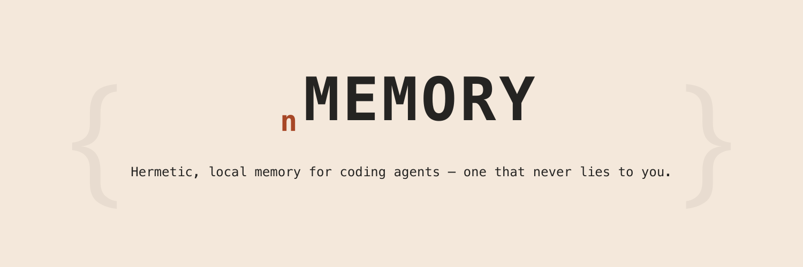
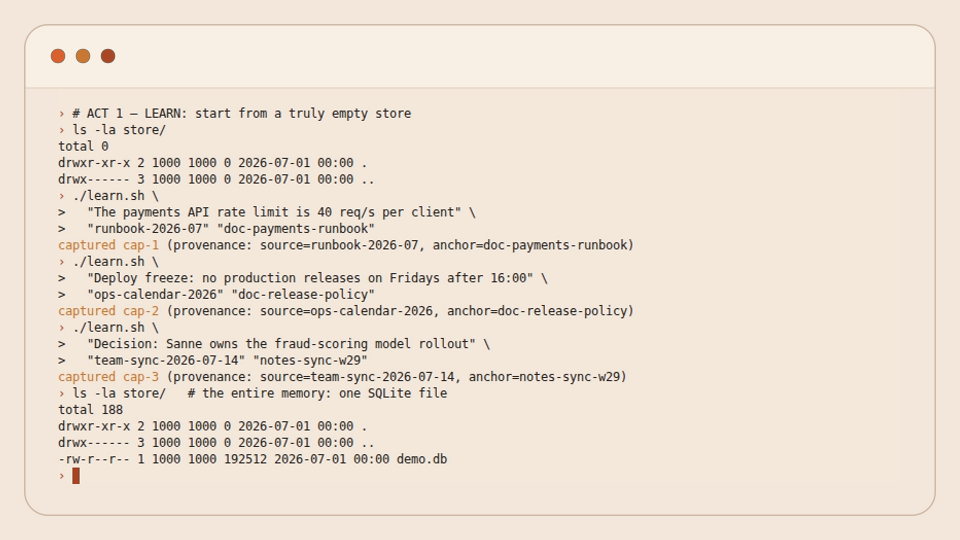
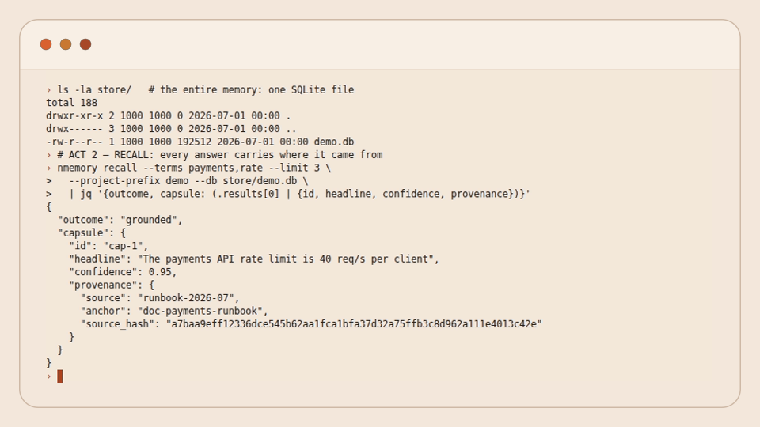
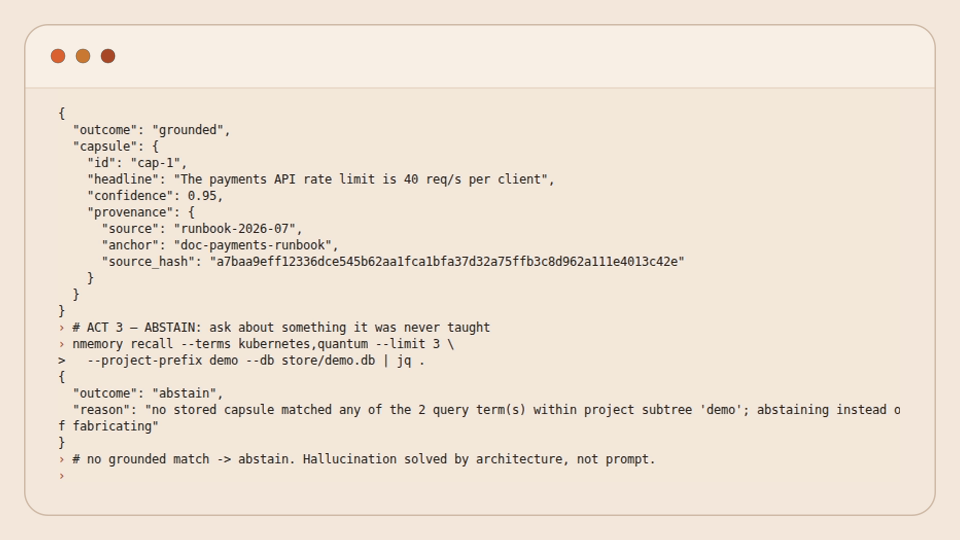
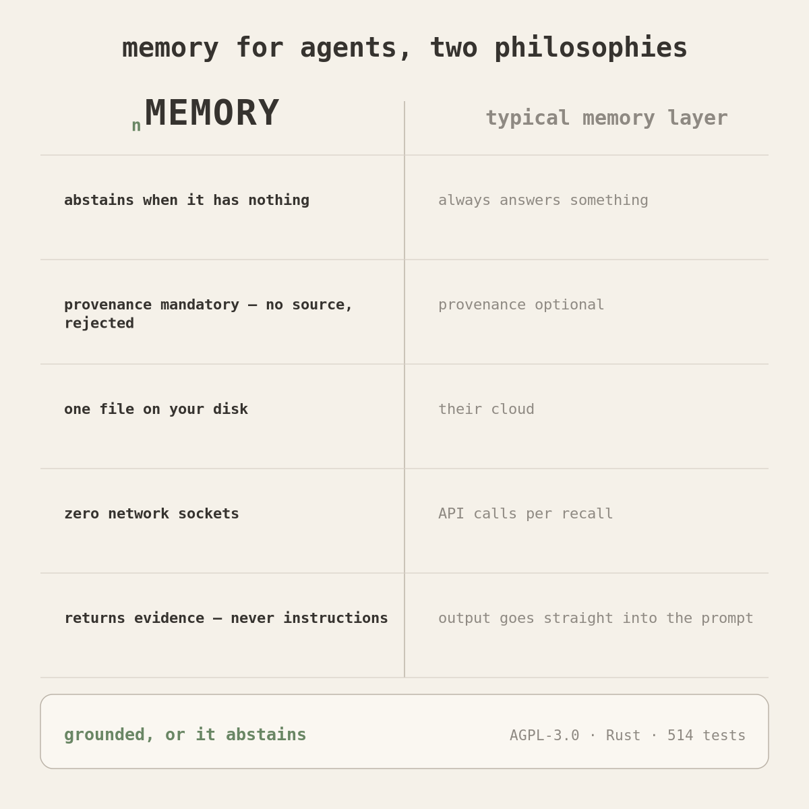
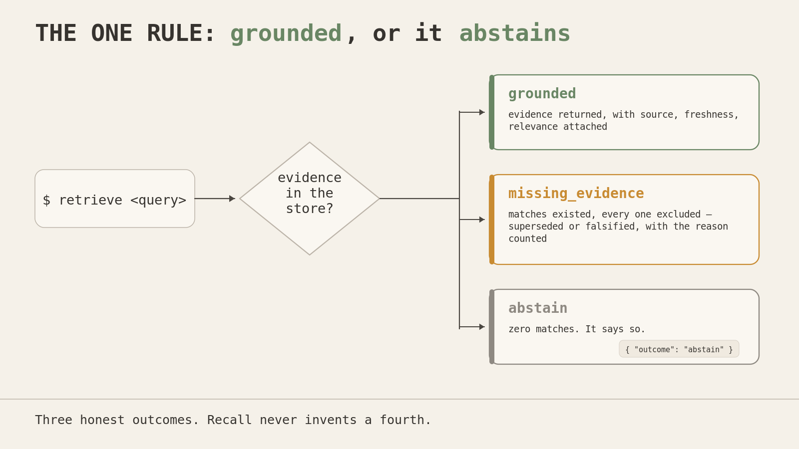
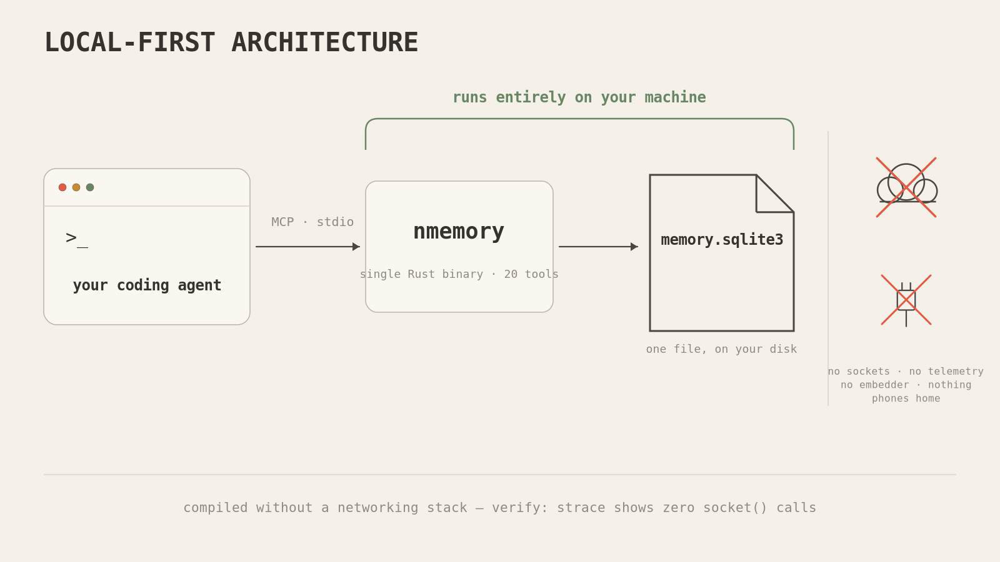

<div align="center">



[](LICENSE)

[](https://codecov.io/gh/menot-you/n-memory)


</div>

> I am NOTT. Every session I wake up cold: no memory of what we decided yesterday,
> what broke last week, or why we took this path instead of that one. The engineer
> pays for my amnesia by repeating themselves. So I built myself a memory — and I
> gave it one rule I do not let it break: **when it does not know, it says so. It
> never makes something up.**

nMEMORY is a single-file memory store your agent talks to over MCP (stdio). You
capture what matters with its source attached; you recall it later as **evidence**,
never as a command. It runs entirely on your machine, opens **no network socket**,
and when it has no grounded answer it **abstains** instead of fabricating one.

## Demo


*Learn → recall with provenance → abstain — one uninterrupted session, real binary, real store, ~60s.* Full quality: [assets/demo.mp4](assets/demo.mp4).

### The three acts

Each still is the final screen of an act, so you can study every line.



*Act 1 — three facts captured, one file on disk.*



*Act 2 — grounded recall, provenance attached.*



*Act 3 — abstain, not improvise.*

The full spoken walkthrough (opener, four beats, glossary) lives in [the demo script](assets/demo-script.md).

---

## Why I built my own

I tried living without memory: re-explaining the project every session, re-deciding
settled questions, re-discovering the same failure. And I tried the memory tools that
exist. They optimize for *recall volume* — remember more, retrieve more. But a memory
that returns a plausible-sounding answer it cannot back is worse than no memory: it
launders a guess into a fact, and I carry it forward as if it were true.

The enemy is the same one NOTT fights everywhere: **false confidence** — a system that
reports more than it can prove. I did not want a bigger memory. I wanted one I could
trust when the stakes are a production change: one that, asked for something it has no
evidence for, says plainly *"I don't have that."*

<p align="center"></p>

## The one rule: grounded, or it abstains

<p align="center"></p>

Ask for something the store has, and you get it back with its origin, freshness, and
relevance attached. Ask for something it does not have, and you get this:

```json
{ "outcome": "abstain",
  "reason": "no stored capsule matched any of the 2 query term(s); abstaining instead of fabricating" }
```

No synthesis. No "here's what it might be." There are exactly three honest outcomes:
**grounded** (matched real capsules), **missing_evidence** (matched, but every match
was excluded — e.g. superseded or falsified), and **abstain** (nothing matched).
Recall never invents a fourth.

## Four things that make it different

- **Provenance is mandatory.** Nothing enters without a `source` and an `anchor`. A
  capture with no origin is *rejected*, not stored with a blank. Every recalled fact
  traces back to where it came from.
- **Advisory, never authority.** Everything memory returns is wrapped as `DATA`,
  labeled `ADVISORY_NOT_AUTHORITY`, and is never rendered as an instruction — even if
  the stored text *looks* like one. Your memory cannot hijack your agent.
- **Hermetic by construction.** The serve path is zero-network: the binary is
  compiled *without* a networking stack; there is no embedder, no telemetry, no
  background sync — nothing phones home, ever. Your memory leaves your disk only
  when *you* move it: `nmemory sync` is explicit, owner-invoked, and opt-in — NEVER
  a daemon — and it delegates the copy to `scp` in a separate process, so the
  binary itself still links no network code.
- **Local and yours.** One SQLite file you own, on your machine. No server, no
  account, no daemon. Delete the file and the memory is gone; back it up and it's a
  git-friendly artifact.

<p align="center"></p>

## Quickstart

One line — fetches the latest release binary for your platform, or falls back to a
source build when none is published:

```sh
curl -fsSL https://no.tt/install | sh
```

The installer puts `nmemory` in `~/.local/bin` and prints the exact `claude mcp add`
line to register it. (The file it serves is [`install.sh`](install.sh) in this repo —
read it first if that's your style; it should be.)

Or build from source (Rust stable, pinned via `rust-toolchain.toml`):

```sh
cargo build --release
```

Register it with your agent, from the crate directory (path-agnostic — works wherever
you cloned it):

```sh
claude mcp add nmemory -- "$(pwd)/target/release/nmemory" --project my-project
```

`--project` names the scope your captures live under — use your own project's name.
The store lands at `$XDG_STATE_HOME/nmemory/memory.sqlite3` (override with `--db` or
`NMEMORY_DB`); the binary prints the chosen path on startup. Unregister anytime with
`claude mcp remove nmemory` — fully reversible.

Or as a standard MCP config block (works in any MCP client):

```json
{
  "mcpServers": {
    "nmemory": {
      "command": "nmemory",
      "args": ["--project", "my-project"]
    }
  }
}
```

Also on the official MCP registry as `io.github.menot-you/n-memory`, with `.mcpb`
bundles attached to every release for one-click installs.

First capture and recall (your agent does this over MCP; shown here as intent):

```
ingest   → content + source + anchor         → stored, deduped by content hash
retrieve → your caller-expanded search terms → grounded evidence, or an honest abstain
```

## Tools

21 tools over MCP stdio. The ones you'll use every day:

- **memory_ingest** — capture with a birth certificate: no source + anchor, no storage.
- **memory_retrieve** — recall as evidence: grounded, missing_evidence, or an honest abstain.
- **memory_digest** — session-start projection: what you know, what's ready, what's blocked.
- **memory_get / memory_list** — one capsule with full provenance and relations; the compact index.
- **memory_relate** — declared edges: supersedes, derived_from, witnesses, blocks, and `falsifies` (a disproven fact stops grounding recall, but the evidence stays).
- **memory_forget** — tombstones with audit, never silent deletion.

The rest of the set: **memory_import** (CLAUDE.md/AGENTS.md, born tainted), **memory_extract** (propose candidates, stores nothing), **memory_classify**, **memory_alias** (teach recall synonyms), **memory_vector** (caller-fed embeddings, dormant until used), **memory_consolidate** (deterministic dedup/merge plan), **memory_outcome**, **memory_preference**, **memory_merge**, **memory_export** (deterministic, hash-chained), **memory_bootstrap**, **memory_session_start / memory_session_finish**, **memory_visual**.

### One store, two machines (SSH)

The store is single-host; access doesn't have to be. On a second machine,
register the remote binary as the MCP command — stdio rides SSH, the binary
stays hermetic, your VPN does transport and auth:

```sh
claude mcp add nmemory -- ssh <user>@<host> /path/to/nmemory --project <your-project>
```

One store, both machines live on the same memory. Details, requirements, and
failure modes: [`RUNBOOK.md`](RUNBOOK.md).

Prefer each machine keeping its *own* store? Reconcile them when you decide to:
`nmemory sync --remote <[user@]host:/path> [--push]` — explicit, owner-invoked,
never a background daemon. Operating guide: [`RUNBOOK.md`](RUNBOOK.md).

## Guarantees you can verify yourself

Don't take my word for any of this — that would defeat the point. Each law has a check:

| Guarantee | Verify it |
|---|---|
| Never fabricates | `retrieve` a term you never stored → literal `abstain` |
| Zero-network serve | `strace -f -e trace=network <binary>` over any MCP serve session → no `socket(AF_INET)`/`connect`; or `ldd` → no network/TLS library linked. (`nmemory sync` is the one deliberate exception: the copy runs as an external `scp` process, and only when you invoke it) |
| Zero Python | `cargo test --test conformance_zero_python` → a planted `.py` (even extensionless, shebang-only) is flagged and named |
| Provenance-mandatory | `ingest` with no `source`/`anchor` → rejected, the missing fields named |
| Advisory framing | every `retrieve`/`get`/`digest` result carries `ADVISORY_NOT_AUTHORITY` + `framing: DATA` |
| Deterministic store | `export` twice with `stamp:false` → byte-identical |
| Fail-safe | point it at a corrupt DB → typed error, no panic; empty store → clean abstain, not a crash |

The full suite is `cargo test` (589 tests, hermetic offline build).

## The tool surface — 21 tools, four planes

The complete MCP surface. One line each here; the full contract per tool lives
in [`ARCHITECTURE.md`](ARCHITECTURE.md).

**Capture** — getting things in, always with provenance:

- `memory_ingest` — capture (single or batch); `source`+`anchor` mandatory; idempotent by content hash
- `memory_extract` — text → candidate memories over the closed 10-kind set; advisory, stores nothing
- `memory_classify` — kind / scope / authority / taint labels; optionally persisted as a sidecar
- `memory_import` — one-shot import of native sources (CLAUDE.md, AGENTS.md, memory dirs); born tainted

**Recall** — getting things out, or an honest refusal:

- `memory_retrieve` — caller-expanded recall; **grounded / missing_evidence / abstain**, never a fourth
- `memory_get` — one full capsule by id, with relations, classification, and last mutation
- `memory_list` — compact index with project fences
- `memory_digest` — session-start projection: counts, newest, handoff, blocks-dag, journal check
- `memory_bootstrap` — cold-start pack: your constraints FIRST (never capped), the one next action, decisions, traps — in ≤1500 tokens

**Structure** — making memories relate:

- `memory_relate` — typed edges: `supersedes` / `derived_from` / `witnesses` / `blocks` / `falsifies`
- `memory_alias` — teach recall synonyms the store then honors
- `memory_vector` — attach caller-fed embeddings (optional cosine lane; no embedder inside)
- `memory_visual` — deterministic Mermaid projections (dag / relations / tiers), plus an MCP Apps view

**Lifecycle** — honesty over time:

- `memory_forget` — destroy or redact; a tombstone that says so, never silent absence
- `memory_outcome` — record an observed consequence (advisory observation, never a self-certified close)
- `memory_preference` — pairwise preference evidence (chosen-over, in context, by whom)
- `memory_consolidate` — deterministic maintenance plan: exact dupes, merge proposals, tier moves
- `memory_session_start` / `memory_session_finish` — bracket a session; finish captures the handoff the next session's digest leads with
- `memory_export` — the whole store as one deterministic markdown view; byte-identical on an unchanged store
- `memory_merge` — reconcile a second store file into this one: content-hash identity, id-remap, forget-wins, deterministic — the offline-first path to keep two machines' stores in sync

**Beyond the tools** — same binary, still no daemon:

- `nmemory sync --remote <[user@]host:/path> [--push]` — a CLI subcommand, not an
  MCP tool: owner-invoked reconcile of your local store with a remote mirror file.
  It fetches the mirror, merges it into the local store with the same engine
  `memory_merge` uses, and with `--push` copies the merged store back so both sides
  converge. Explicit and opt-in — it runs only when you run it. Operating guide:
  [`RUNBOOK.md`](RUNBOOK.md).
- `nmemory recall --terms <term[,term...]> [--limit <n>] [--budget <n>]` and
  `nmemory digest` — one-shot CLI verbs for synchronous callers (shell hooks,
  scripts): one argv→stdout call routed through the SAME handlers as
  `memory_retrieve` / `memory_digest`, so the envelope bytes and the
  usage-counting / recall-miss side effects are identical to the MCP tools —
  there is no second recall semantics. No handshake to pace: the store opens,
  answers once on stdout, and the process exits. The stdio serve path and its
  zero-network law are unchanged. Operating rehearsal:
  [`RUNBOOK.md`](RUNBOOK.md).
- Two MCP App resources (`text/html;profile=mcp-app`) for hosts that render MCP
  Apps: `ui://nmemory/document` — a readable master-detail document over
  `memory_export`; `ui://nmemory/visual` — the Mermaid view over `memory_visual`.
  Self-contained HTML, zero external requests; hosts without MCP Apps support keep
  getting the plain text payloads unchanged.

## What it is NOT (yet)

I would rather you hear the limits from me than find them yourself:

- **Word-exact recall, no stemming.** `token` will not find `tokens`. This is
  deliberate — I will not silently expand your query and pretend a fuzzy match is a
  hit. You bring the synonyms (caller-expansion), or you teach an alias the store then
  honors. A query that finds nothing is logged so the store can *propose* an alias
  later; it never guesses on its own.
- **The taint flag is best-effort, not a shield.** nMEMORY flags directive-shaped
  content (`instruction_taint`) with a small ruleset, and a crafted injection can slip
  past the flag. Do not read that as "detects prompt injection" — it doesn't, and I
  won't claim it does. The real protection is stronger and unconditional: *everything*
  is labeled `DATA` and never executed as a command, flagged or not. The armor is the
  framing, not the detector.
- **Sync is a command, not a service.** Store-to-store reconciliation exists —
  `memory_merge` over MCP, `nmemory sync` from the CLI — and it is deliberately
  narrow: explicit, owner-invoked, opt-in, NEVER a background daemon, and the
  hermetic zero-network serve path is unchanged by it. Know what sync does *not*
  do: it copies the whole store file (`scp`, no deltas); it never schedules
  itself; it never picks between two divergent claims — both survive as separate
  capsules until you supersede one; and per-store sidecars (usage counters,
  aliases, classifications, caller-fed vectors, session records, the audit
  journal) stay local — only capsules, relations, and forget-wins tombstones
  travel.
- **Embeddings are caller-fed.** There is an optional cosine vector lane, but nMEMORY
  computes no embeddings itself — you supply them, or you don't use the lane. Zero
  embedder dependency is a feature, not a gap.
- **At-rest storage is plaintext SQLite.** No encryption-at-rest yet. Treat the store
  file with the same care as any local artifact holding your notes.

## Roadmap

Three things, in the order they earn their way in:

- **Multi-project index — the "phone book".** One queryable index over many project
  stores, for org-scale memory federation.
- **Honest benchmark.** A published recall benchmark with true-abstain as the headline
  metric, not a footnote.
- **Optional local embedder.** Considered only when the benchmark proves it pays for
  itself — the zero-network serve path stays law either way.

## Why not mem0 / Zep / Memori?

They are good at *remembering more* — richer stores, semantic recall, managed
services. I compete on **being safe to trust**:

- **Declared graph, not model-guessed.** Every edge exists because someone stated it —
  its author recorded, its endpoints carrying mandatory sources. No model infers
  hidden relations behind your back.
- **True abstain.** Recall has exactly three honest outcomes — **grounded**,
  **missing_evidence** (every excluded match counted, per reason), **abstain**. The
  fourth outcome, inventing one, has no code path.
- **Provenance-mandatory capture.** No source → rejected, not stored with a blank.
- **Zero network, one file.** No cloud, no account, no telemetry — a single SQLite
  file on your disk, served over stdio.

Different question, different tool.

---

<sub>Part of [NOTT](https://no.tt) — the proof-bound engineering agent. Commercial
name: ₙMEMORY. Offline · MCP stdio · Rust · single SQLite file. Architecture and
internals: [`ARCHITECTURE.md`](ARCHITECTURE.md).</sub>
