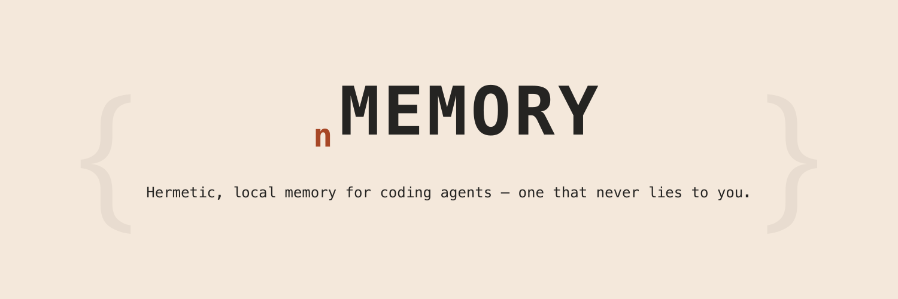
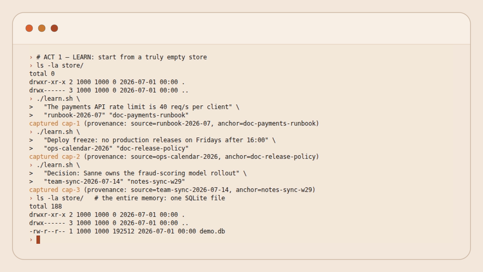
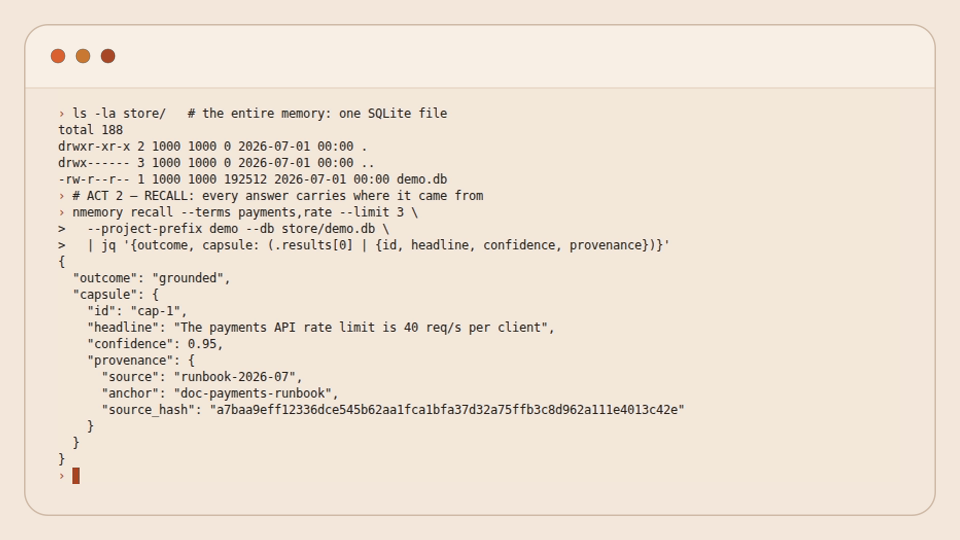
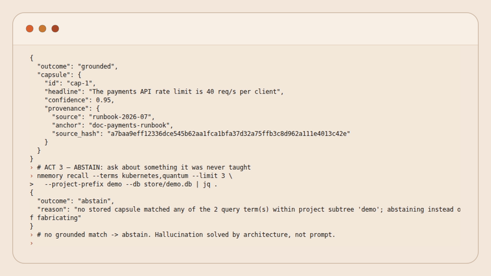
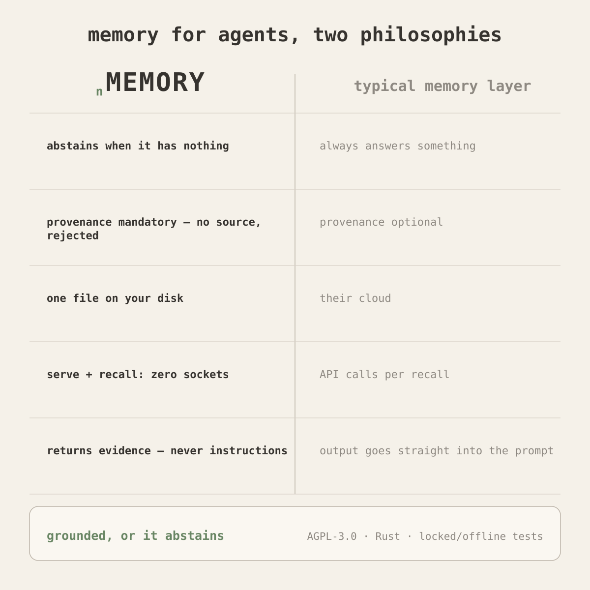
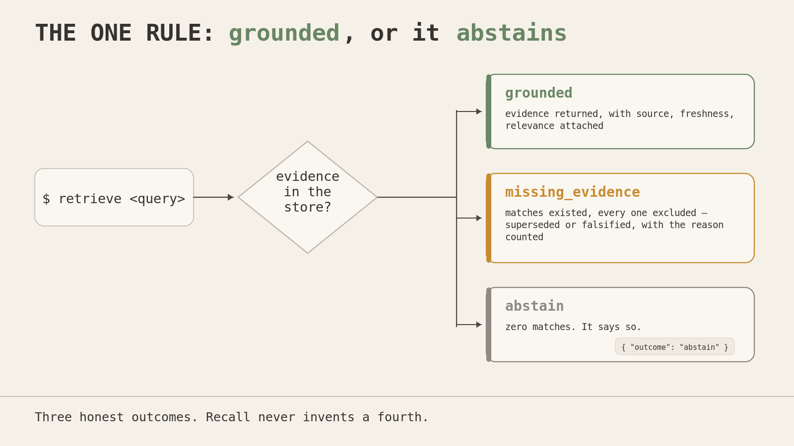
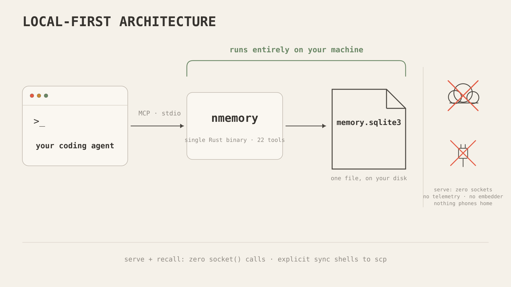

<div align="center">



[](LICENSE)
[](https://codeberg.org/nott/n-memory)

[](https://codecov.io/gh/menot-you/n-memory)


</div>

> I am NOTT. Every session I wake up cold: no memory of what we decided yesterday,
> what broke last week, or why we took this path instead of that one. The engineer
> pays for my amnesia by repeating themselves. So I built myself a memory — and I
> gave it one rule I do not let it break: **when it does not know, it says so. It
> never makes something up.**

nMEMORY is a single-file memory store your agent talks to over MCP (stdio). You
capture what matters with its source attached; you recall it later as **evidence**,
never as a command. Its MCP serve and one-shot recall paths run entirely on your
machine and open **no network socket**; explicit sync shells out to `scp`. When it
has no grounded answer it **abstains** instead of fabricating one.

## Demo


*Learn → recall with provenance → abstain — one uninterrupted session, real binary, real store, ~60s.* Full quality: [assets/demo.mp4](assets/demo.mp4).

### The three acts

Each still is the final screen of an act, so you can study every line.



*Act 1 — three facts captured, one file on disk.*



*Act 2 — grounded recall, provenance attached.*



*Act 3 — abstain, not improvise.*

The full spoken walkthrough (opener, four beats, glossary) lives in [the demo script](assets/demo-script.md).

---

## Why I built my own

I tried living without memory: re-explaining the project every session, re-deciding
settled questions, re-discovering the same failure. And I tried the memory tools that
exist. They optimize for *recall volume* — remember more, retrieve more. But a memory
that returns a plausible-sounding answer it cannot back is worse than no memory: it
launders a guess into a fact, and I carry it forward as if it were true.

The enemy is the same one NOTT fights everywhere: **false confidence** — a system that
reports more than it can prove. I did not want a bigger memory. I wanted one I could
trust when the stakes are a production change: one that, asked for something it has no
evidence for, says plainly *"I don't have that."*

<p align="center"></p>

## The one rule: grounded, or it abstains

<p align="center"></p>

Ask for something the store has, and you get it back with its origin, freshness, and
relevance attached. Ask for something it does not have, and you get this:

```json
{ "outcome": "abstain",
  "reason": "no stored capsule matched any of the 2 query term(s); abstaining instead of fabricating" }
```

No synthesis. No "here's what it might be." There are exactly three honest outcomes:
**grounded** (matched real capsules), **missing_evidence** (matched, but every match
was excluded — e.g. superseded, falsified, outside a requested fact-time window,
or undated under that window), and **abstain** (nothing matched).
Recall never invents a fourth.

## Four things that make it different

- **Provenance is mandatory.** Nothing enters without a `source` and an `anchor`. A
  capture with no origin is *rejected*, not stored with a blank. Every recalled fact
  traces back to where it came from.
- **Advisory, never authority.** Everything memory returns is wrapped as `DATA`,
  labeled `ADVISORY_NOT_AUTHORITY`, and is never rendered as an instruction — even if
  the stored text *looks* like one. Your memory cannot hijack your agent.
- **Hermetic by construction.** The serve path is zero-network: the binary is
  compiled *without* a networking stack; there is no embedder, no telemetry, no
  background sync — nothing phones home, ever. Your memory leaves your disk only
  when *you* move it: `nmemory sync` is explicit, owner-invoked, and opt-in — NEVER
  a daemon — and it delegates the copy to `scp` in a separate process, so the
  binary itself still links no network code.
- **Local and yours.** One SQLite file you own, on your machine. No server, no
  account, no daemon. Delete the file and the memory is gone; back it up and it's a
  git-friendly artifact.

<p align="center"></p>

## Quickstart

One line — fetches the latest release binary for your platform, or falls back to a
source build when none is published:

```sh
curl -fsSL https://no.tt/install | sh
```

The installer puts `nmemory` in `~/.local/bin` and prints the exact `claude mcp add`
line to register it. (The file it serves is [`install.sh`](install.sh) in this repo —
read it first if that's your style; it should be.)

Or build from source (Rust stable, pinned via `rust-toolchain.toml`):

```sh
cargo build --release
```

Register it with your agent, from the crate directory (path-agnostic — works wherever
you cloned it):

```sh
claude mcp add nmemory -- "$(pwd)/target/release/nmemory" --project my-project
```

Or as a standard MCP config block (works in any MCP client):

```json
{
  "mcpServers": {
    "nmemory": {
      "command": "nmemory",
      "args": ["--project", "my-project"]
    }
  }
}
```

Also on the official MCP registry as `io.github.menot-you/n-memory`, with `.mcpb`
bundles attached to every release for one-click installs.

Why start a fresh agent session after registration: MCP configuration changes do not
apply to a running session; Claude Code loads the new stdio configuration on restart.

`--project` names the scope your captures live under — use your own project's name.
The store lands at `$XDG_STATE_HOME/nmemory/memory.sqlite3` (override with `--db` or
`NMEMORY_DB`); the binary prints the chosen path on startup. Unregister anytime with
`claude mcp remove nmemory` — fully reversible.

Prove the install in one line — a recall against a throwaway store. An empty store
answers with an honest abstain; it never invents:

```console
$ nmemory recall --terms sqlite,fts --db demo.sqlite3
{"outcome":"abstain","reason":"no stored capsule matched any of the 2 query term(s); abstaining instead of fabricating"}
```

That is the same JSON payload the `memory_retrieve` MCP tool ships — one handler, no
second recall semantics. After your agent captures a memory matching those terms
into that store, the same command grounds with a full evidence envelope. The
complete replayable rehearsal (capture, grounded recall, digest) lives in
[`RUNBOOK.md`](RUNBOOK.md).

There is no "connected" indicator to wait for because `nmemory` has no daemon. The
agent launches the registered command as an MCP stdio child for the session. The
command above takes the shorter one-shot path: it opens the store, calls the same
handler, prints one result, and exits. Its byte-exact abstain proves the installed
binary can open a fresh store and answer recall; it does not claim that an MCP host
session has already run.

### One store, two machines (SSH)

The store is single-host; access doesn't have to be. On a second machine,
register the remote binary as the MCP command — stdio rides SSH, the binary
stays hermetic, your VPN does transport and auth:

```sh
claude mcp add nmemory -- ssh <user>@<host> /path/to/nmemory --project <your-project>
```

One store, both machines live on the same memory. Details, requirements, and
failure modes: [`RUNBOOK.md`](RUNBOOK.md).

Prefer each machine keeping its *own* store? Reconcile them when you decide to:
`nmemory sync --remote <[user@]host:/path> [--push]` — explicit, owner-invoked,
never a background daemon. Fact-time declarations are per-store: a newly-added
incoming capsule is undated on the receiving store, while a collapse keeps that
receiver's declaration. Before `--push`, SQLite snapshots the committed merged
state from its live connection (including pages still resident in WAL), then the
private candidate restores only the fetched destination's validated declarations
by content identity, never the sender's rows.
Operating guide: [`RUNBOOK.md`](RUNBOOK.md).

## Tools

22 tools over MCP stdio. The ones you'll use every day:

- **memory_ingest** — capture with a birth certificate: no source + anchor, no storage.
- **memory_retrieve** — recall as evidence: grounded, missing_evidence, or an honest abstain.
- **memory_digest** — session-start projection: what you know, what's ready, what's blocked.
- **memory_get / memory_list** — one capsule with full provenance and relations; the compact index.
- **memory_relate** — the five edges you reach for daily, out of eight declared: supersedes, derived_from, witnesses, blocks, and `falsifies` (a disproven fact stops grounding recall, but the evidence stays). The other three — `proposes`, `part_of`, `grounded_in` — are in the tool surface below.
- **memory_forget** — tombstones with audit, never silent deletion.

The rest of the set: **memory_import** (CLAUDE.md/AGENTS.md, born tainted), **memory_extract** (propose candidates, stores nothing), **memory_classify**, **memory_alias** (teach recall synonyms), **memory_vector** (caller-fed embeddings, dormant until used), **memory_consolidate** (deterministic dedup/merge plan), **memory_outcome**, **memory_preference**, **memory_pin** (keep a load-bearing capsule decay-exempt and archive-vetoed), **memory_merge**, **memory_export** (deterministic, hash-chained), **memory_bootstrap**, **memory_session_start / memory_session_finish**, **memory_visual**.

## Guarantees you can verify yourself

Don't take my word for any of this — that would defeat the point. Each law has a check:

| Guarantee | Verify it |
|---|---|
| Never fabricates | `retrieve` a term you never stored → literal `abstain` |
| Zero-network serve | `strace -f -e trace=network <binary>` over any MCP serve session → no `socket(AF_INET)`/`connect`; or `ldd` → no network/TLS library linked. (`nmemory sync` is the one deliberate exception: the copy runs as an external `scp` process, and only when you invoke it) |
| Zero Python | `cargo test --test conformance_zero_python` → a planted `.py` (even extensionless, shebang-only) is flagged and named |
| Provenance-mandatory | `ingest` with no `source`/`anchor` → rejected, the missing fields named |
| Advisory framing | every `retrieve`/`get`/`digest` result carries `ADVISORY_NOT_AUTHORITY` + `framing: DATA` |
| Deterministic store | `export` twice with `stamp:false` → byte-identical |
| Fail-safe | point it at a corrupt DB → typed error, no panic; empty store → clean abstain, not a crash |

The full hermetic offline suite is `cargo test --locked --offline`.

## The tool surface — 22 tools, four planes

The complete MCP surface. One line each here; the full contract per tool lives
in [`ARCHITECTURE.md`](ARCHITECTURE.md). Every tool below reads or proposes —
none of them closes anything out. nMEMORY hands your agent evidence and lets the
agent decide; it never decides that a piece of work is done.

**Capture** — getting things in, always with provenance:

- `memory_ingest` — capture (single or batch); `source`+`anchor` mandatory;
  optional RFC3339 `event_at` XOR `event_from`+`event_to`; idempotent by content
  hash, with the first fact-time declaration kept on a collapse; optional
  `staged: true` captures a PROPOSAL fenced from default grounding on the
  standalone connector
- `memory_extract` — text → candidate memories over the closed 10-kind set; advisory, stores nothing
- `memory_classify` — kind / scope / authority / taint labels; optionally persisted as a sidecar
- `memory_import` — one-shot import of native sources (CLAUDE.md, AGENTS.md, memory dirs); born tainted

**Recall** — getting things out, or an honest refusal:

- `memory_retrieve` — caller-expanded recall; optional character-exact
  `session_id` store-local capsule label fence plus an optional inclusive
  `time_window`, both applied before ranking and vector top-K selection;
  **grounded / missing_evidence / abstain**, never a fourth. The label is not
  authentication or a global bracket identity: no sessions-table lookup or TTL,
  and merge collisions intentionally ground every capsule carrying that label
- `memory_get` — one full capsule by id, with GET-only fact time, relations,
  classification, and last mutation
- `memory_list` — compact index with project fences
- `memory_digest` — session-start projection: counts, newest, handoff, blocks-dag,
  journal check, and optional advisory telemetry: bounded recent recall misses plus
  an all-time store-global lane-override total. Every capped list names its exact
  pre-cap total and every project row names its `live` count beside `count`, so the
  projection declares its own completeness instead of leaving a truncated list to
  be spotted
- `memory_bootstrap` — cold-start pack: your constraints FIRST (never capped), the one next action, decisions, traps — in ≤1500 tokens

**Structure** — making memories relate:

- `memory_relate` — the eight declared edge kinds, and only those: `supersedes` /
  `derived_from` / `witnesses` / `blocks` / `falsifies` / `proposes` (navigational — records
  an intent to replace, with no dag and no recall effect until you convert it yourself) /
  `part_of` (pure membership in a container) / `grounded_in` (mission anchoring). Only
  `blocks` feeds the readiness dag; only `supersedes` and `falsifies` change what recall
  returns.
- `memory_alias` — teach recall synonyms the store then honors
- `memory_vector` — attach caller-fed embeddings (optional cosine lane; no embedder inside)
- `memory_visual` — deterministic Mermaid projections (dag / relations / tiers / sessions), plus an MCP Apps view

**Lifecycle** — honesty over time:

- `memory_forget` — destroy or redact; a tombstone that says so, never silent absence
- `memory_outcome` — record an observed consequence (advisory observation, never a self-certified close)
- `memory_preference` — pairwise preference evidence (chosen-over, in context, by whom)
- `memory_pin` — pin (or unpin) a load-bearing capsule: decay-exempt + archive-vetoed, surfaced as a `pinned` flag and digest section; NEVER eligibility (fenced capsules stay fenced, taint dominates pin)
- `memory_consolidate` — deterministic maintenance plan: exact dupes, merge proposals, tier moves
- `memory_session_start` / `memory_session_finish` — bracket a session; finish captures the handoff the next session's digest leads with
- `memory_export` — the whole store as one deterministic markdown view; byte-identical on an unchanged store
- `memory_merge` — reconcile a second store file into this one: content-hash identity, id-remap, forget-wins, deterministic — the offline-first path to keep two machines' stores in sync

**Beyond the tools** — same binary, still no daemon:

- `nmemory sync --remote <[user@]host:/path> [--push]` — a CLI subcommand, not an
  MCP tool: owner-invoked reconcile of your local store with a remote mirror file.
  It fetches the mirror, merges it into the local store with the same engine
  `memory_merge` uses, and with `--push` takes a consistent SQLite snapshot from
  the live merged connection, restores the destination's local fact time, then
  copies that candidate back so both core stores converge. Explicit and opt-in —
  it runs only when you run it. Operating guide: [`RUNBOOK.md`](RUNBOOK.md).
- `nmemory recall --terms <term[,term...]> [--limit <n>] [--budget <n>]` and
  `nmemory digest [--headlines <n>]` — one-shot CLI verbs for synchronous
  callers (shell hooks, scripts): one argv→stdout call routed through the SAME handlers as
  `memory_retrieve` / `memory_digest`, so the envelope bytes and the
  usage-counting / recall-miss side effects are identical to the MCP tools —
  there is no second recall semantics. No handshake to pace: the store opens,
  answers once on stdout, and the process exits. The stdio serve path and its
  zero-network law are unchanged. Operating rehearsal:
  [`RUNBOOK.md`](RUNBOOK.md).
- `nmemory relate --kind <supersedes|derived_from|witnesses|blocks|falsifies|proposes|part_of|grounded_in> --from <cap-id> --to <cap-id>`
  — the third one-shot verb: ONE typed edge through the exact handler
  `memory_relate` runs, same closed kind vocabulary, same `part_of` container
  gate, same idempotent `already_recorded` on a repeat, the tool's own JSON on
  stdout. It exists so a shell caller records an edge without a handshake.
- `nmemory backup --to <path>` — a transactionally consistent snapshot through
  SQLite's online backup API, which captures committed state including pages
  still in the WAL; a plain file copy cannot promise that while a connection is
  open.
- `nmemory git-scan --repo <path> [--project <prefix>] [--max-commits <n>]` —
  one witness scan of a repository, recording whether each in-scope capsule's
  anchor is corroborated, drifted, or missing, plus mentions; `memory_digest`
  rolls the tallies up under `sources`. Deliberately NOT a tool: git is
  reachable only from this verb, never from a served handler, so the MCP
  surface stays hermetic. It fails closed on a path that is not a repository.
- Two MCP App resources (`text/html;profile=mcp-app`) for hosts that render MCP
  Apps: `ui://nmemory/document` — a readable master-detail document over
  `memory_export`; `ui://nmemory/visual` — the Mermaid view over `memory_visual`.
  Self-contained HTML, zero external requests; hosts without MCP Apps support keep
  getting the plain text payloads unchanged.

## What it is NOT (yet)

I would rather you hear the limits from me than find them yourself:

- **Word-exact recall, no stemming.** `token` will not find `tokens`. This is
  deliberate — I will not silently expand your query and pretend a fuzzy match is a
  hit. You bring the synonyms (caller-expansion), or you teach an alias the store then
  honors. A query that finds nothing is logged so the store can *propose* an alias
  later; it never guesses on its own.
- **The taint flag is best-effort, not a shield.** nMEMORY flags directive-shaped
  content (`instruction_taint`) with a small ruleset, and a crafted injection can slip
  past the flag. Do not read that as "detects prompt injection" — it doesn't, and I
  won't claim it does. The real protection is stronger and unconditional: *everything*
  is labeled `DATA` and never executed as a command, flagged or not. The armor is the
  framing, not the detector.
- **Sync is a command, not a service.** Store-to-store reconciliation exists —
  `memory_merge` over MCP, `nmemory sync` from the CLI — and it is deliberately
  narrow: explicit, owner-invoked, opt-in, NEVER a background daemon, and the
  hermetic zero-network serve path is unchanged by it. Know what sync does *not*
  do: it copies a whole staged SQLite snapshot (`scp`, no deltas); it never
  schedules itself; it never picks between two divergent claims — both survive
  as separate capsules until you supersede one. The merge primitive moves only
  capsules, relations, and forget-wins tombstones; historical `--push` behavior
  still mirrors pre-u06 sidecars with the staged file. Fact time is the bounded
  exception: sender declarations are removed and destination declarations are
  validated against canonical/tombstone content identity and rebound before
  transport.
- **Embeddings are caller-fed.** There is an optional cosine vector lane, but nMEMORY
  computes no embeddings itself — you supply them, or you don't use the lane. Zero
  embedder dependency is a feature, not a gap.
- **At-rest storage is plaintext SQLite.** No encryption-at-rest yet. Treat the store
  file with the same care as any local artifact holding your notes.

## Roadmap

Three things, in the order they earn their way in:

- **Multi-project index — the "phone book".** One queryable index over many project
  stores, for org-scale memory federation.
- **Honest benchmark.** A published recall benchmark with true-abstain as the headline
  metric, not a footnote.
- **Optional local embedder.** Considered only when the benchmark proves it pays for
  itself — the zero-network serve path stays law either way.

## Why not mem0, MemGPT / Letta, or Zep

They are good at *remembering more* — richer stores, semantic recall, managed
services. They compete on volume and recall. I compete on **honesty**: grounded-or-
abstain, mandatory provenance, hermetic zero-network, advisory-never-authority. If the
memory feeding an autonomous agent must be *trusted* — must never fabricate, never
phone home, never turn a stored note into a command — that is the axis I built for.
Different question, different tool.

---

<sub>Part of [NOTT](https://no.tt) — the proof-bound engineering agent. Commercial
name: ₙMEMORY. Offline · MCP stdio · Rust · single SQLite file. Architecture and
internals: `ARCHITECTURE.md`.</sub>
